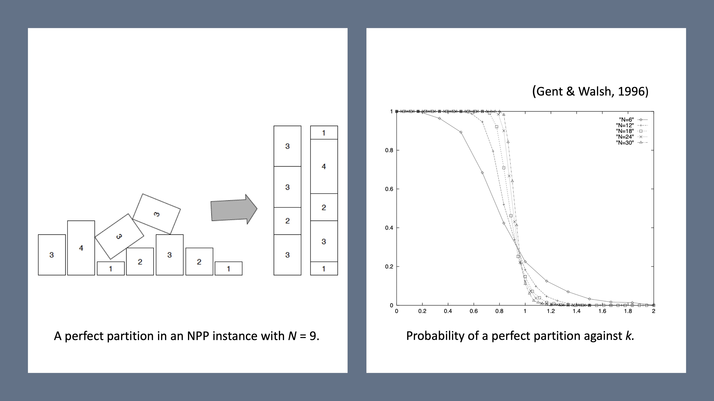

# NPP-Landscapes
Fitness landscapes and local optima networks (LONs) Number Partitioning Problem (NPP).

This repo contains data and code related to the paper:

G. Ochoa, N. Veerapen, F. Daolio, M. Tomassini (2017) [Understanding Phase Transitions with Local Optima Networks: Number Partitioning as a Case Study](https://link.springer.com/chapter/10.1007/978-3-319-55453-2_16).  European Conference on Evolutionary Computation in Combinatorial Optimization, EvoCOP 2017.  LNCS vol. 10197, Springer pp. 233–248.   [[PDF](assets/Understanding_Phase_Transitions_with_LONS_NPP.pdf)]

## The Number Partitioning Number (NPP)

The Number Partitioning Problem (NPP) is defined as follows. Given a set of $N$ positive numbers $L=\{r_1,r_2, \ldots, r_N\}$,
find a partition $A \cup B = L$ such that the partition difference $D$ is minimised.
$$
D = \left| \sum_{r_i \in A} r_i - \sum_{r_i \in B} r_i \right|
$$

A partition is perfect if $D = 0$

The decision version of the NPP belongs to the class of NP-complete problems which appear to require a super-polynomial amount of computation time in the instance input size. NP-hard optimisation problems are at least as hard as the corresponding decision problems.
 

Fig.1 Number partitioning problem (NPP). An example of a perfect partition (left). Graphic depiction of the *phase transition* from easy to hard instances.

Figure 1 illustrates the problem, showing an example of a perfect partition (left) visualised as two sets of equal height. The right plot in Fig. 1, depicts the NPP phase transition. Several hard constraint-satisfaction problems show an instance-dependent *computational phase transition*, meaning that below some critical point, instances are typically easy to solve while they become hard to solve above such a point.

The existence of the NPP hardness phase transition was first demonstrated numerically by [Gent and Walsh in 1996](https://dblp.org/rec/conf/ecai/GentW96.html), who introduced the control parameter $k$ and estimated the transition point to occur around $k_c$= 0.96. The control parameter $k$  corresponds to the number of significant bits in the encoding of the input numbers $r_i$ divided by $N$ (the instance size), specifically $k = log_2(M)/N$, where $M$ is the largest number in the set $L=\{r_1,r_2, \ldots, r_N\}$.  For $log_2(M)$ and $N$ tending to infinity, the transition occurs at the critical value of $k_c = 1$, such that for $k < 1$, there are many perfect partitions with probability tending to 1, whereas for $k > 1$, the number of perfect partitions drops to zero with probability tending to 1. 

## Fitness Landscape Analysis
A fitness landscape is a triplet $(S, N, f)$ where $S$ is a set of admissible solutions i.e., a search space, $N: S \longrightarrow 2^S$, is a neighbourhood structure, a function that assigns a set of neighbours $N(s)$ to every solution $s \in S$, and $f : S \longrightarrow \mathbb{R}$ is a fitness function that measures the quality of the corresponding solutions.  We define below these three components for the NPP.

*Search space*. The search space consists of binary strings of length $N$. 

*Neighbourhood Structure*. We use the standard Hamming distance 1 neighbourhood (1-bit-flip operator). The Hamming distance between two strings is the number of positions in which they differ. Therefore, the neighbourhood $N(s)$ of solution $s$ includes the set of all solutions one bit-flip apart from $s$. The size of the neighbourhood is $N - 1$.

*Fitness Function*. The fitness function to be minimised is the partition difference $D$ formulated above.

## Structure of the Repository
There are three folders: **data**,  **sampling** and **scripts**, as described below.
### Data 
Contains three folders:

* [fitness](data/fitness/): has two text files corresponding to two example NPP instances with $N = 10$ and  $k$ = 0.4 and 1.0, respectively. This represent an easy instance with many perfect partitions ($k = 0.4$), and a hard instance with very few perfect partitions $k = 0.4$. Each file contains the full enumeration of the search spaces, with 3 columns:id, solution and fitness.
* [instance](data/instance/): has two files corresponding to the instance data (numbers to partition) for the two example NPP instances with $N = 10$ and  $k$ = 0.4 and 1.0, respectively.
* [lon_full](data/lon_full/): has two zip files containing the fully enumerated  nodes and edges of the two example NPP instances with $N = 10$ and  $k$ = 0.4 and 1.0, respectively.

### Sampling
Contains Python code files:
* [ils.py](sampling/ils.py): implements a solution class for binary strings and an iterated local search (ILS) algorithm for sampling local optima networks.
* [problems.py](sampling/problems.py): implements a problem class for optimisation problems including initialisation, move operators and the objective function. Two problems are implemented, the single knapsack problem and the number partitioning problem.

### Scripts
There are two R scripts as described below. 
* [lon_create_full.R](scripts/lon_create_full.R) Reads zip files with nodes and edges(from the [lon_full](data/lon_full/) folder) and constructs local optima networks graph objects, including the standard LON model, the monotonic model (MLON) and the compressed model (CMLON). The graph models are saved within .RData files in a directory called "lons_full/". You need to create a local folder named "lons_full/" before running this script.
* [lon_plot_full.R](scripts/lon_plot_full.R) Reads graph objects (from .RData files in the "lons_full/" folder) for and produces network plots in 2D and 3D. 

## Suggested Exercises
1. Consider the search space of two NPP instances provided in the [data/fitness/](data/fitness/) folder and conduct:
    a. A density of state (DOS) analysis 
    b. A Fitness distance (FDC) analysis
    c. Do this analyses reflect a difference between the easy ($k=0.4$) and the hard instance ($k=1.0$)?
2. Consider the fully enumerated local optima network data in the [data/lon/](data/lon) folder:
    a. Run the [lon_create_full.R](scripts/lon_create_full.R) to construct the LON models
    b. Run the[lon_plot_full.R](scripts/lon_plot_full.R) to visualise the network models. 
3. The data provided corresponds to fully enumerated LONs. However, for larger landscapes, sampling is required to construct LON models.
    a. Run the Python code provided in the 'sampling' folder to generate data to construct sampled LON models
    b. Write an R script to construct the LON models
    c. Write an R script to visualise the sampled LON models
